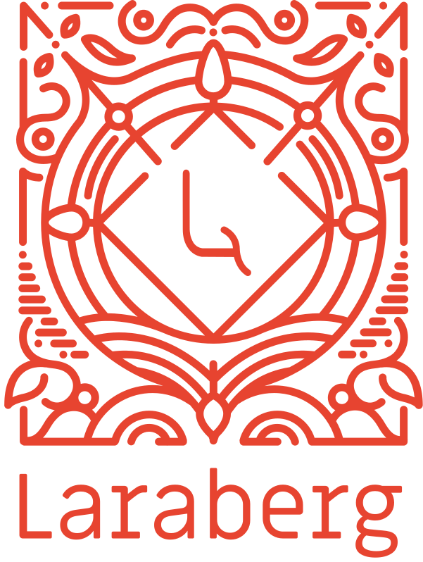

#  <!-- omit in toc -->
[](https://packagist.org/packages/van-ons/laraberg)

[](https://gitter.im/VanOns/laraberg?utm_source=badge&utm_medium=badge&utm_campaign=pr-badge)


Laraberg aims to provide an easy way to integrate the Gutenberg editor with your Laravel projects. It takes the Gutenberg editor and adds all the communication and data it needs function in a Laravel environment. A demo can be found at [demo.laraberg.io](http://demo.laraberg.io/). If you would like to see an example of how to implement Laraberg you can take a look at the code from the demo  [over here](https://github.com/VanOns/laraberg-demo).

# Table of Contents <!-- omit in toc -->
- [Installation](#installation)
  - [JavaScript and CSS files](#javascript-and-css-files)
  - [Dependencies](#dependencies)
- [Updating](#updating)
- [Usage](#usage)
  - [Initializing the Editor](#initializing-the-editor)
    - [Using the Editor Wihout a Form](#using-the-editor-wihout-a-form)
    - [Setting the editor content](#setting-the-editor-content)
    - [Configuration options](#configuration-options)
  - [Models](#models)
    - [Renaming Gutenbergable method names](#renaming-gutenbergable-method-names)
  - [Rendering Gutenberg Content](#rendering-gutenberg-content)
  - [Custom Blocks](#custom-blocks)
    - [Registering Blocks](#registering-blocks)
    - [Registering Categories](#registering-categories)
  - [Events](#events)
  - [Sidebar](#sidebar)
    - [Checkbox](#checkbox)
    - [Radio](#radio)
    - [Select](#select)
    - [Text](#text)
    - [Textarea](#textarea)
- [Configuration](#configuration)
  - [Styling](#styling)
  - [API Routes](#api-routes)
  - [Laravel File Manager](#laravel-file-manager)
- [Search Callback](#search-callback)
- [Missing Blocks](#missing-blocks)
- [Contributing](#contributing)

# Installation

Install package using composer:

```bash
composer require van-ons/laraberg
```

Add vendor files to your project (CSS, JS & Config):

```bash
php artisan vendor:publish --provider="VanOns\Laraberg\LarabergServiceProvider"
```

In order to store the data for the Gutenberg editor, Laraberg needs to run a database migration:

```
php artisan migrate
```

This will create the 'lb_contents' and 'lb_blocks' tables.

## JavaScript and CSS files

The package provides a JS and CSS file that should be present on the page you want to use the editor on: 

```html
<link rel="stylesheet" href="{{asset('vendor/laraberg/css/laraberg.css')}}">

<script src="{{ asset('vendor/laraberg/js/laraberg.js') }}"></script>
```

## Dependencies

The Gutenberg editor expects React, ReactDOM, Moment and JQuery to be in the environment it runs in. An easy way to do this would be to add the following lines to your page:

```html
<script src="https://unpkg.com/react@16.8.6/umd/react.production.min.js"></script>

<script src="https://unpkg.com/react-dom@16.8.6/umd/react-dom.production.min.js"></script>
```

# Updating

When updating Laraberg you have to publish the vendor files again by running this command:
```bash
php artisan vendor:publish --provider="VanOns\Laraberg\LarabergServiceProvider" --tag="public" --force
```

# Usage

## Initializing the Editor

The Gutenberg editor should replace an existing textarea in a form. On submit the raw content from the editor will be put in the 'value' attribute of this textarea.

```html
<textarea id="[id_here]" name="[name_here]" hidden></textarea>
```

In order to edit content on an already existing model we have to set the value of the textarea to the raw content that the Gutenberg editor provided.

```html
<textarea id="[id_here]" name="[name_here]" hidden>{{$model->getRawContent()}}</textarea>
```

To initialize the editor all we have to do is call the initialize function with the id of the textarea. You probably want to do this insde a DOMContentLoaded event.

And that's it! The editor will replace the textarea in the DOM and on a form submit the editor content will be available in the textarea's value attribute.

```js
Laraberg.init('[id_here]')
```

### Using the Editor Wihout a Form

If you want to use the editor, but for some reason do not want to deal with submitting forms there is a way to get the content from the editor through JavaScript:

```js
let content = Laraberg.getContent()
```

### Setting the editor content

It's possible to set the the editor's content using JavaScript:

```js
Laraberg.setContent('content')
```

### Configuration options

The `init()` function takes an optional configuration object which can be used to change Laraberg's behaviour in some ways.
```js
const options = {}
Laraberg.init('[id_here]', options)
```

The `options` object can contain the following optional keys:

|Key                        |Type         |Description                                                                                  |
|---------------------------|-------------|---------------------------------------------------------------------------------------------|
|**sidebar**                |Boolean      |Enables the Laraberg sidebar if `true`                                                       |
|**prefix**                 |String       |The API prefix to use for requests (only use this if you changed the API location manually)  |
|**laravelFilemanager**     |Bool/Object  |Enables Laravel Filemanager for fileuploads if value is truth. Can be an object that contains configuration options. See [Laravel File Manager](#laravel-file-manager).                                                                             |
|**sidebar**                |Boolean      |Enables the Laraberg sidebar if `true`                                                       |
|**searchCb**               |Function     |Will be called when using certain search fields within Gutenberg. See [Search Callback](#search-callback).|
|**height**                 |String       |Sets the height of the editor. Value must be a valid css height value (e.g. '10px', '50%', '100vh').|
|**minHeight**              |String       |Sets the minHeight of the editor. Value must be a valid css min-height value (e.g. '10px', '50%', '100vh').|
|**maxHeight**              |String       |Sets the maxHeight of the editor. Value must be a valid css max-height value (e.g. '10px', '50%', '100vh').|

## Models

In order to add the editor content to a model Laraberg provides the 'Gutenbergable' trait.

```php
use VanOns\Laraberg\Models\Gutenbergable;

class MyModel extends Model {
  use Gutenbergable;
}
```

This adds multiple attributes to your model that will help you with creating/updating/rendering the Gutenberg content.

```php
$content // This is the raw content from the Gutenberg editor
$model = new MyModel;

// Add or update the content
$model->lb_content = $content;

// Save the model
$model->save();

// Get the rendered HTML
$model->lb_content;

// Get the raw Gutenberg output, this should be in the target textarea when updating content
$model->lb_raw_content;
```

> Note: The old renderContent, getRawContent, getRenderedContent and setContent methods from v0.0.4-beta and lower are deprecated and will be removed in a future release.

### Renaming Gutenbergable method names

There is always the possibility that your model already implements a method with the same name as one of the Gutenbergable methods. Luckily PHP Traits provide an easy way to rename the methods from a trait:

```php
class MyModel extends Model {
  use Gutenbergable {
    renderContent as renderLBContent;
  }

  public function renderContent() {
    // Your method
  }
}
```
In this example you can just call the 'renderLBContent' method to render the content.

## Rendering Gutenberg Content

Rendering the Gutenberg content is very simple and happens like this:

```html
<div id="your_container"> <!-- The element you want to render the content in -->
  {!! $page->lb_content !!}
</div>
```

Keep in mind that in order to correctly display some of the Wordpress styling the Laraberg CSS has to be present on the page:

```html
<link rel="stylesheet" href="{{asset('vendor/laraberg/css/laraberg.css')}}">
```

## Custom Blocks

Gutenberg allows developers to create custom blocks. For information on how to create a custom block you should read the [Gutenberg documentation.](https://wordpress.org/gutenberg/handbook/designers-developers/developers/tutorials/block-tutorial/writing-your-first-block-type/)

### Registering Blocks

Registering custom blocks is fairly easy. A Gutenberg block requires the properties `title`, `icon`, and `categories`. It also needs to implement the functions `edit()` and `save()`.

```js
const myBlock =  {
  title: 'My First Block!',
  icon: 'universal-access-alt',
  category: 'my-category',

  edit() {
    return <h1>Hello editor.</h1>
  },

  save() {
    return <h1>Hello saved content.</h1>
  }
}

Laraberg.registerBlock('my-namespace/my-block', myBlock)
```

### Registering Categories

If you want to add your custom block to a new category you need to add that category first:

```js
let title = 'My Category'
let slug = 'my-category'
Laraberg.registerCategory(title, slug)
```

## Events

Laraberg implements Laravel events that you can use to implement your own listeners. The events contain a 'content' attribute that contains the relevant Content object. For information on how Laravel events work you can read the [Laravel documentation](https://laravel.com/docs/5.8/events).

- VanOns\Laraberg\Events\ContentCreated
- VanOns\Laraberg\Events\ContentRendered
- VanOns\Laraberg\Events\ContentUpdated

## Sidebar

Laraberg provides a way to put your form fields in a seperate sidebar in the Gutenberg editor. This way you can let the editor take the entire screen while still having a place for your form fields. This is done by putting the input element in a parent element with the `.laraberg-sidebar` class. This is currently supported for the following input types:
- Checkbox
- Radio
- Select
- Text
- Textarea

For the labels Laraberg first checks if there is a label assigned to the element and will try to use that. If there is no label assigned it will check if there is a placeholder and use that as the label.

To enable the sidebar set the `sidebar` option to true when initializing Laraberg:
```js
Laraberg.init('[id_here]', { sidebar: true })
```

### Checkbox
```HTML
<div class="laraberg-sidebar">
  ...
  <label for="article-public">Public</label>
  <input id="article-public" name="public" type="checkbox">
</div>
```

### Radio

```HTML
<div class="laraberg-sidebar">
  ...
  <label for="letter-a">A</label>
  <input type="radio" name="letter" id="letter-a" value="a" checked> 
  <label for="letter-b">B</label>
  <input type="radio" name="letter" id="letter-b" value="b"> 
  <label for="letter-c">C</label>
  <input type="radio" name="letter" id="letter-c" value="c">
</div>
```

### Select
```HTML
<div class="laraberg-sidebar">
  ...
  <label for="article-month">Month</label>
  <select id="article-month" name="month" class="uk-select uk-form-large ">
      <option value="1">January</option>
      <option value="2">February</option>
      <option value="3">March</option>
      <option value="4">April</option>
      ...
  </select>
</div>
```

### Text
```HTML
<div class="laraberg-sidebar">
  ...
  <input id="article-title" type="text" name="title" placeholder="Title" />
</div>
```

### Textarea
```HTML
<div class="laraberg-sidebar">
  ...
  <textarea name="excerpt" id="article-excerpt" placeholder="Excerpt"></textarea>
</div>
```

# Configuration

When initializing the editor there are a number of configuration options you can provide. This is still a work in progress!

## Styling

It is possible to set the height, maxHeight, and minHeight of the editor by providing the desired values in the options object:

```js
Laraberg.init('[id_here]', { height: '500px' })

Laraberg.init('[id_here]', { maxHeight: '500px' })

Laraberg.init('[id_here]', { minHeight: '500px' })
```

## Placeholder

You can change the default Gutenberg placeholder by adding a placeholder attribute to your textarea:

```html
<textarea placeholder="[placeholder_here]" id="[id_here]" name="[name_here]" hidden></textarea>
```

## API Routes

After publishing the vendor files you can find the 'laraberg.php' file in your config folder. This file allows you to configure the API Routes. Here you can change the URL prefix and the middleware for the routes.

When you change the route prefix you also have to provide the prefix when you initialize the editor like this:

```js
Laraberg.init('[id_here]', { prefix: '/[prefix_here]' })
```

If you wish to define the routes yourself you can do that by setting 'use_package_routes' to 'false' in the config. Then you can take the following routes and make changes as you see fit:

```php
Route::group(['prefix' => 'laraberg', 'middleware' => ['web', 'auth']], function() {
  Route::apiResource('blocks', 'VanOns\Laraberg\Http\Controllers\BlockController');
  Route::get('oembed', 'VanOns\Laraberg\Http\Controllers\OEmbedController');
});
```

## Laravel File Manager

Laraberg supports [Laravel File Manager](https://unisharp.github.io/laravel-filemanager/) for uploading files. To enable uploading media through Laravel File Manager the laravelFilemanager field should be set to true. This will add a 'File Manager' button to the Gutenberg media blocks that will open Laravel File Manager for uploading and selecting media files.

```js
Laraberg.init('[id_here]', { laravelFilemanager: true })
```

If you are not using the default routes for Laravel File Manager you can provide the location of your Laravel File Manager endpoints in the options object like this:

```js
Laraberg.init('[id_here]', { laravelFilemanager: { prefix: '/[lfm_prefix_here]' } })
```

> Note: Laraberg does not do any configuration on your Laravel File Manager setup. By default a lot of media filetypes can not be uploaded unless they are whitelisted in the Laravel File Manager configuration file. For more information on this you can check the [Laravel File Manager documentation](https://unisharp.github.io/laravel-filemanager/config).

# Search Callback

The **button block** has a field that searches for pages or aritcles. In order to use this functionality you can pass a
callback function when initializing Laraberg. This callback functions will receive a `search`, `perPage` and `type` parameter. The callback should return an array of objects that contain a title and an URL or a promise that resolves to such an array.

```javascript
let customSearch = (search, perPage, type) => {
  return [
    {
      title: 'Laraberg Demo',
      url: 'demo.laraberg.io'
    }
  ]
}

Laraberg.init('content', { searchCb: customSearch })
```

# Missing Blocks

Since we have disabled direct file uploading, some of the media blocks require a media library to operate.
This means that the following blocks will only be enabled when you're using Laravel Filemanager for now:

- Cover
- Gallery
- Media & Text

# Contributing

If you want to contribute to Laraberg checkout the [CONTRIBUTING.md](https://github.com/VanOns/laraberg/blob/master/CONTRIBUTING.md)

<div align="center">
	<br><br><br>
	<a href="https://van-ons.nl">
	    
	</a>
  <br>
</div>
